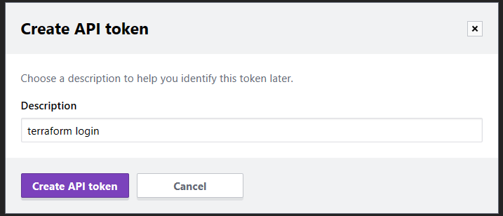
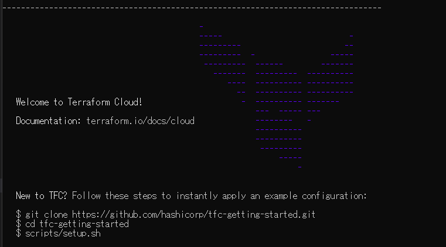
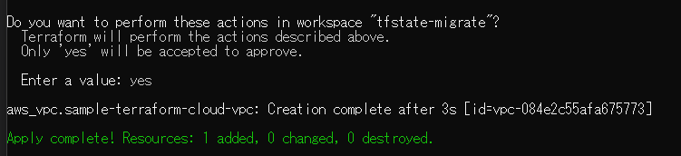
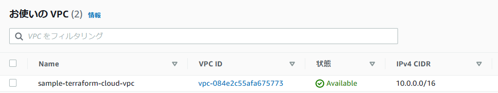

# Terraformとは？
- HashiCorp社によって開発されている
- オープンソースのサービス
- IaC（Infrastructure as Code）のツールの一つ
- クラウドもコードで管理することができる
- コードで管理したクラウド環境は、自動で構築できる

# 重要なファイル
- [.tfファイル](https://developer.hashicorp.com/terraform/language/syntax/json)
- [terraform.tfstateファイル](https://developer.hashicorp.com/terraform/language/state)
- [.tfvarsファイル](https://developer.hashicorp.com/terraform/language/values/variables)

# よく使うコマンド
- [terraform init](https://developer.hashicorp.com/terraform/cli/commands/init)
- [terraform plan](https://developer.hashicorp.com/terraform/cli/commands/plan)
- [terraform apply](https://developer.hashicorp.com/terraform/cli/commands/apply)
- [terraform destroy](https://developer.hashicorp.com/terraform/cli/commands/destroy)

# 覚えておくべき記述
- resource
- data
- variables 
- locals

# 早く実践したいという方向けのリンク
- [Terraformの導入手順](#install-terraform)


# それぞれのファイルの役割

<a id="#detail-tffile"></a>
## .tfファイル
- terraformがリソースの作成を行う際に、参照する情報
- 構築したいインフラのリソース情報をここに記載する

<a id="#detail-tfstate"></a>
## terraform.tfstate
- terraformは、2回目以降の実行では、初回実行時との差分のリソースを検出し、差分を適用するように動く。
- この差分の比較元となるのが、このファイル
- もっというと、初回実行した後の状態というのを、このファイルで管理している
- これがあるおかげで、一発でdestroyして作った環境をなかったことにすることもできる。
- このファイルは、コマンドを実行すると自動的に生成される。
- ## **絶対に消さないように！！**


<a id="#details-tfvars"></a>
## .tfvars
- 変数を外だしするためのファイル
- `variables.tf`は変数を宣言するが、このファイルではその宣言されたファイル内に存在する変数名に、値を設定することができる。
- このファイルの使われ方としては、環境ごとに異なる定義をしたい場合
  - `prd.tfvars`、 `stg.tfvars`、 `dev.tfvars` 等


<a id="install-terraform"></a>
# 導入手順

## **前提事項**
- aws cliのインストールと、リソース作成権限のあるIAMのアクセスキー・シークレットアクセスキーの設定が完了済みであること！  
※詳細はAWSのアウトプットを参照  
[AWS CLIの導入](/AWS/001_基礎/AWSCLI_main.md)

- 下記のサイトを参考に導入する。  
https://zoo200.net/terraform-tfenv/
- ちなみに、terraformerというツールもあり、こちらは既に構築済みの環境から、terraform形式に落としてきてくれるらしい。  
https://zoo200.net/export-aws-with-terraformer/#toc3
- その他参考リンク  
https://www.youtube.com/watch?v=QmIqt_sdLx4

## 1. terraformを落としてくる
- terraformのバージョンを簡単に管理するための`tfenv`というものを使用する。githubにあるので、cloneで落としてくる
```sh
$ git clone https://github.com/tfutils/tfenv.git ~/.tfenv

# ここではホームディレクトリを指定。場所は各々で変える
$ mkdir ~/bin ; ln -snf ~/.tfenv/bin/* ~/bin
```

- インストール可能なバージョンを確認する
```sh
$ tfenv list-remote
1.4.0-rc1
1.4.0-beta2
1.4.0-beta1
1.4.0-alpha20221207
1.4.0-alpha20221109
1.3.9
1.3.8
...
```

## 2. インストール
- バージョン指定によるインストール方法と、バージョンを指定しないインストール方法がある。  
バージョンを指定しなければ、最新のものが取得される。（.terraform-versionがある場合は別）
```sh
$ tfenv install 1.3.9
```

## 3. 初期化する
- まずは作業用のディレクトリを作成する
```sh
# 任意の場所に、任意のフォルダ名をつけてください
$ mkdir terraform-work
$ cd terraform-work
```

- `terraform.tf`ファイルを作成し、Providerを指定する。
```sh
# 下記を記載して保存
provider "aws" {
  region     = "ap-northeast-1"
}
```
- terraform initを実行
```sh
$ terraform init
```
- ここまでで一旦初期化は完了


## 4. VPCを作ってみる

- リソースファイルを作成する。簡単に、VPCを作成してみる。  
公式ドキュメント：https://registry.terraform.io/providers/hashicorp/aws/latest/docs/resources/vpc
```
resource "aws_vpc" "sample-vpc"{
  cidr_block = "192.168.10.0/24"
  tags = {
    Name = "sample-vpc"
  }
}
```
- VPCではそのVPC内のネットワーク領域を決めるために、`cidr_block`か`ipv4_netmask_length`のどちらかは必ず指定する必要がある。


## 5. tfstateファイルを、Terraform Cloudに保存しておく
- 今までの手順ではローカルに`tfstate`が保存される。  
もちろんそのままでも動くか、ベストプラクティス的にはこの`tfstate`ファイルは、クラウド上のストレージサービス上で管理した方がよい。
  - 理由としては、terraformで作成した環境が、プロジェクトで使用しているような開発環境や本番環境の場合、各々のローカルにあると万が一では`apply`等で競合してしまう。Githubでも一応管理はできるが、`push`しなければ同じことは起こりうる。
  - そのため、1つの共有している環境に対しては、その状態を持つ`tfstate`ファイルも1つであるべきという考え方のもと、誰でも見れるクラウドストレージが推奨されている。

### 手順
- Terraform Cloudは、5人チームまでであれば、無料で使用できる。  
https://developer.hashicorp.com/terraform/tutorials/cloud-get-started/cloud-sign-up

- アカウントを持っていない方はこちらから登録  
https://developer.hashicorp.com/sign-up

- ここから `Let's Try terraform cloud`  
https://cloud.hashicorp.com/products/terraform

- 先ほど作ったアカウントでログイン

- チュートリアルに従って、Terraform Cloudに.tfstateファイルを移行する
  - terraformを使って作業するディレクトリに、`sample-terraform-cloud.tf`を作成する。（ファイル名は任意で大丈夫）
```
terraform {
  cloud {
    organization = "＜登録したユーザー名＞"

    workspaces {
      name = "＜任意＞"
    }
  }
}
```
  - `terraform login`を実行する。続行を確認されるので、yesを入力する。
  ```
  terraform login
  ```
  - すると、以下のような画面が表示される。
  
  - Create API Tokenをクリックし、表示されている内容をコピー
  
  - 先ほど`terraform login`と入力したターミナル上で、API Tokenを入力する。
  
  
  - なんかかっこいい  

　
  - terraform initを実行する。
  ```
  terraform init
  ```
  - 適当にAWSリソース用のファイルを作成する
  ```
  resource "aws_vpc" "sample-terraform-cloud-vpc"{
    cidr_block = "10.0.0.0/16"
    tags = {
      Name = "sample-terraform-cloud-vpc"
    }
  }
  ```
  - いざ、実行
  ```
  terraform apply
  ```
  - ...エラーになる？

### AWSの認証情報
- エラーの内容を見る限り、awsへのcredential情報がなく落ちているみたい
- 内部の仕組み等は不明だが、一旦.tfvarsにアクセスキー・シークレットキーを追加して、対処する。手順は以下の通り。
  1. 変数を宣言する。  
  access_keyとsecret_key用の変数を宣言する。今回は、provider.tfに記載する。
  
  provider.tf
  ```
  variable "access_key" {}
  variable "secret_key" {}

  provider "aws" {
    region = "ap-northeast-1"
    access_key = var.access_key
      secret_key = var.secret_key
  }
  ```
  2. 変数を定義する。  
  credentials.tfvarsというファイルを作成する。  
  ※定義するクレデンシャル情報は、AWSのリソースが作成できる権限であること。

  credentials.tfvars
  ```
  access_key  = "XXXXXXXXXXXXXXXXXXXX"
  secret_key  = "XXXXXXXXXXXXXXXXXXXXXXXXXXXXXXXXXXXXXXXXXX"
  ```
  3. .gitignoreに追加する。（既に追加されていれば不要）

  .gitignore
  ```
  credentials.tfvars
  ```

  4. terraformコマンド実行時に引数に渡す
  ```
  terraform plan --var-file=./credentials.tfvars
  ```

- 今度こそ、いざ実行
  
- AWSのマネジメントコンソールにログインして確認してみる
  

- これで、tfstateファイルをクラウドストレージに管理しながら、terraformの実行環境が整った。


## 補足
### 使用できるクラウドストレージ
  - 基本的にはどこでも利用はできる。AWSであればS3だし、GCPであればGCS


