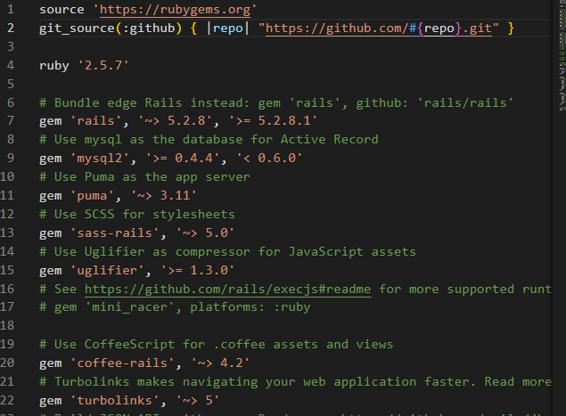
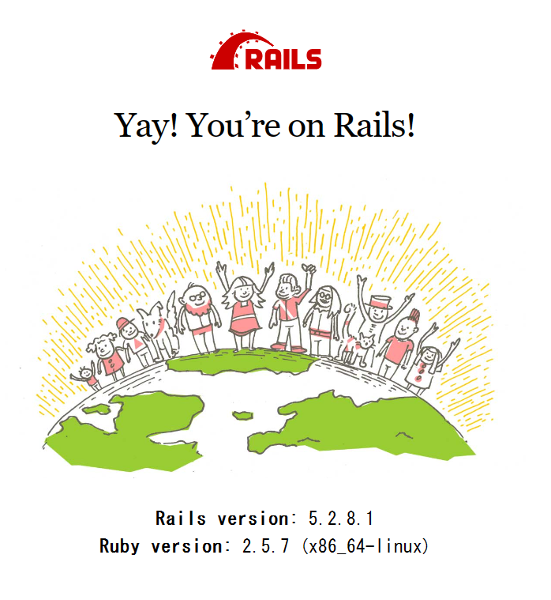
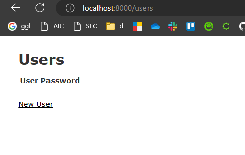

# 目次
- [今回の環境構築の概要](#summary)
- [前提](#requirement)
- [ファイルの作成](#create_file)
- [補足情報](#others)


---
<a id="summary"></a>
# 今回の環境構築の概要
- 手軽にアプリを作成したいので、Dockerを使用して環境構築する
- 以下のサイトを参考に環境構築  
https://qiita.com/Yusuke_Hoirta/items/3a50d066af3bafbb8641

---
<a id="requirement"></a>
# 前提
- Dockerがインストールされていること

---
<a id="create_file"></a>
# ファイルの作成

## 以下の空ファイルを作成する
- Dockerfile
- docker-compose.yml
- Gemfile
- Gemfile.lock

## Dockerfile
- Rubyのイメージを使用するため、以下のように記述する


---

# Ruby on Railsのベースファイル作成

### 以下のコマンドを、Rubyのコンテナ内で実行する
```
docker-compose run web rails new . --force --database=mysql --skip-bundle
```
- --databaseオプションをつけなかった場合、デフォルトではSQLiteを使うらしい。
- 今回はMySQLを使うため、データベースのオプションをつけてあげる。
- ついでに、使用可能なデータベースは以下。
  - mysql
  - oracle
  - postgresql
  - sqlite3
  - frontbase
  - ibm_db
  - sqlserver
  - jdbcmysql
  - jdbcsqlite3
  - jdbcpostgresql
  - jdbc


- コマンド実行後は、Gemfileが更新されるらしい


### この更新されたGemfileを元に、ビルドする
```
docker-compose build
```

### `database.yml`を編集する
- 編集箇所は、`password`と`host`
- 必要に応じて、database名も変更する
```
  password: pass
  host: db
```
- この時、コンテナ内に入らずにホスト側で直接編集しようとすると、権限がなく失敗する。
- 頻繁に編集するファイルでもないので、chmodで一時的に編集可能にするか、コンテナの中に入って、vim等で編集することで対応できた。


### DBの作成
```
docker-compose exec web rails db:create
```
- この時に作成されるデータベース名は、database.ymlに記述されている。


### 疎通確認
- `http://localhost:8000`にアクセスして、以下のページが表示されればOK



### ホットリロードの有効化
- `config/environments/development.rb`のファイルにある、`config.file_watcher`を、以下のように修正することで、変更を検知しホットリロードしてくれる。
```
config.file_watcher = ActiveSupport::FileUpdateChecker
```


# WebAPIをサンプルで作る
- ユーザー情報のAPIを作成してみる
- 以下のサイトを参考にする  
https://qiita.com/ruemura3/items/4e99a968b18b49829301

### 省略するところ
- Dockerでrailsのベース自体は作成しているので、`rails new`のコマンドは使用しない

### 以下のコマンドを入力
```
docker-compose exec web rails g scaffold user user_id:string password:string
```
### DBをマイグレーション
```
docker-compose exec web rails db:migrate
```

### 終わり

- ファイルを自動的に作ってくれるのがめちゃくちゃありがたい、、、これは捗る、、、

# 感想
- 慣れれば数分で、ベースとなるAPIの作成はできそう
- フォルダ構成も一緒に作られているので、そのレイヤーやアーキテクチャに沿う方針であれば、手間が最小限で済みそう

---
<a id="others"></a>
# 補足情報
- Rubyのdockerイメージ  
https://hub.docker.com/_/ruby

